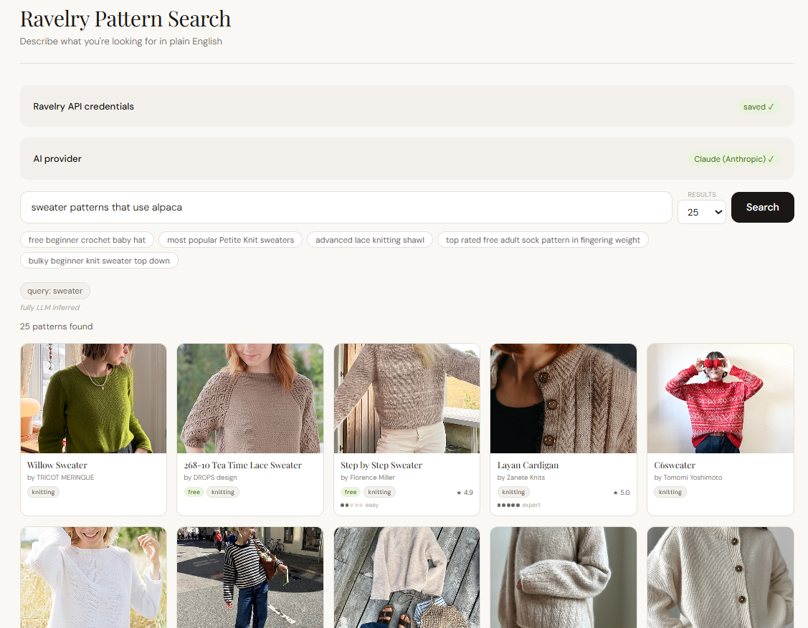

# Ravelry AI Search + RAG

Natural language pattern search for [Ravelry](https://www.ravelry.com) powered by your choice of AI provider, with a RAG (Retrieval Augmented Generation) layer that pre-indexes Ravelry taxonomy data and designer information for dramatically more accurate results.

This is the RAG-enhanced version of [search_ravelry_with_LLM](https://github.com/shannonlps/search_ravelry_with_LLM), which is preserved as a clean non-RAG checkpoint.



---

## What the RAG layer does

Without RAG, the LLM has to guess how to translate your query into Ravelry API parameters. It doesn't know that "Petite Knit" is a designer with a specific ID, that "top down" maps to `pa=top-down`, or that "most popular" means `sort=projects`.

With RAG, before the LLM is called, a local vector database resolves:

- **Designer names → Ravelry designer IDs** — "Petite Knit" resolves to the correct `designer_id`
- **Category names → `pc` values** — "beanie" resolves to `pc=beanie-toque`
- **Attribute descriptions → `pa` values** — "top down circular yoke" resolves to `pa=top-down+circular-yoke`
- **Fit, age, gender → `fit` values** — "women's petite" resolves to `fit=female+petite`
- **Fiber types** — "merino wool" resolves to `fiber=merino`
- **Needle sizes** — "US 8 needles" resolves to the correct mm value
- **Sort/availability/difficulty** — rule-based extraction from natural language

The UI shows two tiers of result pills — green 🗄 pills for RAG-resolved values, neutral pills for LLM-inferred values.

---

## Project structure

```
search_ravelry_with_LLM_and_RAG/
├── backend/
│   ├── main.py              ← FastAPI app with RAG integration
│   └── requirements.txt     ← includes chromadb + sentence-transformers
├── frontend/
│   ├── src/
│   │   ├── App.jsx          ← React UI with RAG pill display
│   │   ├── App.css
│   │   └── main.jsx
│   ├── index.html
│   ├── package.json
│   └── vite.config.js
├── rag/
│   ├── ingest.py            ← run once to build the database
│   ├── retriever.py         ← imported by backend/main.py
│   ├── requirements.txt
│   └── data/
│       ├── static/
│       │   ├── parameters.json    ← all API params with aliases
│       │   ├── categories.json    ← full pc category tree
│       │   ├── attributes.json    ← full pa attribute list
│       │   ├── fibers.json        ← fiber types with synonyms
│       │   └── needle_sizes.json  ← US/metric conversion chart
│       ├── seed_designers.txt     ← ~350 popular designers
│       ├── progress.json          ← gitignored, tracks ingest state
│       └── chroma_db/             ← gitignored, generated by ingest.py
├── .env.example
├── .gitignore
└── README.md
```

---

## Prerequisites

- Python 3.10+
- Node.js 18+
- Two sets of Ravelry API credentials (one for the app, one dedicated for ingest)
- An API key for at least one of: Anthropic, OpenAI, or Google Gemini

---

## Getting Ravelry API credentials

1. Go to [ravelry.com/pro/developer](https://www.ravelry.com/pro/developer)
2. Create **two apps**, both with "Basic Auth: read only access"
   - App 1: your main app credentials (entered in the UI at search time)
   - App 2: dedicated ingest credentials (set in `.env` for `ingest.py`)

---

## Setup

### 1. Clone the repo

```bash
git clone https://github.com/shannonlps/search_ravelry_with_LLM_and_RAG.git
cd search_ravelry_with_LLM_and_RAG
```

### 2. Configure environment variables

```bash
cp .env.example .env
```

Edit `.env` and add your ingest Ravelry credentials:

```
INGEST_RAVELRY_USERNAME=your_ingest_api_username
INGEST_RAVELRY_PASSWORD=your_ingest_api_password
```

### 3. Install backend dependencies

```bash
cd backend
python -m venv venv

# Windows:
venv\Scripts\activate
# Mac/Linux:
source venv/bin/activate

pip install -r requirements.txt
```

### 4. Install frontend dependencies

```bash
cd ../frontend
npm install
```

---

## Building the RAG database

Run `ingest.py` once to build the local vector database. The script is resumable — it respects Ravelry's 100 requests/day limit and picks up where it left off each run.

```bash
cd rag
python ingest.py
```

Expected output:
```
==================================================
  Ravelry RAG Ingest
==================================================

Loading embedding model (all-MiniLM-L6-v2)...
  ✓ Model loaded

Building static collections (no API calls)...
  ✓ parameters     (47 documents)
  ✓ categories     (183 documents)
  ✓ attributes     (312 documents)
  ✓ fibers         (26 documents)
  ✓ needle_sizes   (23 documents)

Fetching designers from seed list...
  [1/350] PetiteKnit → id:90405 ✓
  [2/350] Andrea Mowry → id:12043 ✓
  ...
  ⏸  Daily limit approaching (90 requests). Stopping cleanly.
     Progress saved. Run again tomorrow to continue.

Done. 90 API requests used this run.
Designer progress: 90/350
Run again tomorrow to continue (260 designers remaining).
```

Run once per day until complete (~4 days for ~350 designers). The static collections rebuild instantly on every run — only the designer fetch is rate-limited.

**The app works without the RAG database** — it falls back to fully LLM-inferred params if `chroma_db/` doesn't exist yet. RAG resolution improves progressively as more designers are indexed.

---

## Running locally

Two terminals simultaneously:

**Terminal 1 — Backend:**
```bash
cd backend
venv\Scripts\activate        # Windows
# or: source venv/bin/activate  (Mac/Linux)
uvicorn main:app --reload --port 8000
```

**Terminal 2 — Frontend:**
```bash
cd frontend
npm run dev
```

Open [http://localhost:3000](http://localhost:3000).

---

## Using the app

1. Enter your **Ravelry API credentials** (your main app credentials, not the ingest ones)
2. Choose your **AI provider** and enter your API key
3. Type a natural language query and search
4. Green 🗄 pills show RAG-resolved values, neutral pills show LLM-inferred values

---

## RAG configuration

Tune these constants at the top of `rag/ingest.py`:

```python
DESIGNER_MIN_PATTERNS = 100   # lower to get more designers
DAILY_REQUEST_LIMIT   = 90    # conservative buffer under Ravelry's 100/day
```

And in `rag/retriever.py`:

```python
DESIGNER_THRESHOLD  = 0.85   # confidence needed to resolve a designer
CATEGORY_THRESHOLD  = 0.80
ATTRIBUTE_THRESHOLD = 0.75
```

---

## How it works

1. User types a query
2. **RAG retriever** runs locally — detects designer names, categories, attributes, fit params, fiber, needle size using vector similarity against ChromaDB
3. RAG results + the original query are injected into the **LLM prompt** — the LLM only fills in what RAG didn't resolve
4. Backend merges RAG + LLM params, RAG always wins on conflicts
5. Ravelry API is called with the resolved params
6. Pattern details fetched in batches of 10
7. Results displayed as 5-column card grid

---

## Known limitations

- **Designer index is a seed list** — ~350 popular designers. Obscure designers won't resolve until the dynamic refresh is implemented (planned).
- **Pattern name resolution not implemented** — specific named patterns like "the Flax sweater" won't resolve by name.
- **Yarn brand resolution not implemented** — planned for a future iteration.

---

## Planned next steps

- Dynamic nightly refresh of designer index
- Paginated designer sweep for designers with >=100 patterns (beyond seed list)
- Yarn brand indexing
- Pattern name resolution via live Ravelry search fallback

---

## License

MIT
